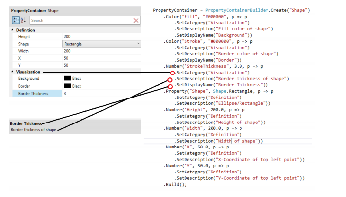
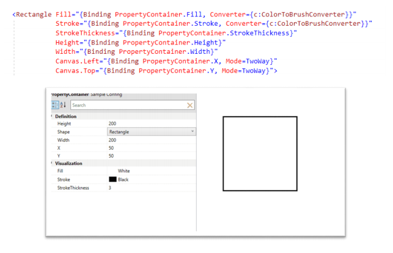

# <center>DataContainer.NET</center>
###### <center>*A strongly typed settings framework*</center>

## Purpose
- Create a settings /configuration framework that is strongly typed so that it easy to create UI to
view and edits the settings object.
- Make serialized XML clean so that user can edit the file directly with a text editor without any
confusion if a dedicated editor/viewer is not available.
- Publish change notifications whenever a property changes value
- Should work well with Data Binding
- Should be cross platform

## DataContainer and PropertyContainer
These classes solve the above-mentioned problems.  
The difference between the two is that PropertyContainer is designed to work well with UI, It stores
more information about values stored such as **Description**, **Category**, whether the value is **Read-only**
etc.  
The XML produced when serializing to is cross-compatible with each other. That is, you can read
PropertyContainer from DataContainer XML and vice-versa.

## Creation
**DataContainer** and **PropertyContainer** instances can be created by using **DataContainerBuilder** and
**PropertyContainerBuilder** classes respectively.  
```
PropertyContainer = PropertyContainerBuilder.Create("Shape")
    .Color("Fill", "#000000", p => p
        .SetCategory("Visualization")
        .SetDescription("Fill color of shape")
        .SetDisplayName("Background"))
    .Color("Stroke", "#000000", p => p
        .SetCategory("Visualization")
        .SetDescription("Border color of shape")
        .SetDisplayName("Border"))
    .Number("StrokeThickness", 3.0, p => p
        .SetCategory("Visualization")
        .SetDescription("Border thickness of shape")
        .SetDisplayName("Border Thickness"))
    .Property("Shape", Shape.Rectangle, p => p
        .SetCategory("Definition")
        .SetDescription("Ellipse/Rectangle"))
    .Number("Height", 200.0, p => p
        .SetCategory("Definition")
        .SetDescription("Height of shape"))
    .Number("Width", 200.0, p => p
        .SetCategory("Definition")
        .SetDescription("Width of shape"))
    .Number("X", 50.0, p => p
        .SetCategory("Definition")
        .SetDescription("X-Coordinate of top left point"))
    .Number("Y", 50.0, p => p
        .SetCategory("Definition")
        .SetDescription("Y-Coordinate of top left point"))
    .Build();
```
This pattern allows to better visualize the hierarchy of values that it contains.  

## Retrieving Values
###### Method 1
```
double height = 0;
PropertyContainer.GetValue("Height", ref height);
```
This is a safe way to retrieve values, if the property is not present, it will do nothing, since we're using
ref, the value has to be initialized, so you I'll be left with the default value you provide if property of the
given name does not exist, and will return false if property is not present.
###### Method 2
```
double width = PropertyContainer.GetValue<double>("Width");
```
This will return **default(T)** if the property is not present, that is, it�ll return null for reference types, 0 for
numeric types, false for Boolean and so on.
###### Method 3
```
double strokeThickness = (double)PropertyContainer["StrokeThickness"];
```
This will throw **KeyNotFoundException** if property is not present
###### Method 4 ( not recommended )
```
dynamic dynamicObj = PropertyContainer;
Shape shape = dynamicObj.Shape
```
Will throw Runtime Exception if property is not present based on the platform.
###### Method 5 ( recommended )
Values can be retrieved by passing Key\<T\> object to GetValue method.  
```
public class Key<T>
{
    public string Name { get; set; }
    public T DefaultValue { get; set; }
}
```
In real world you should use something like below.  
```
public static class Key
{
    public static readonly Key<double> Height => new Key<double>("Height", 25);
}
```
The reason for using this is, the key itself is associated with type. So human error of casting to wrong
type can be avoided provided that all the keys are defined properly.  
```
double height = PropertyContainer.GetValue(Key.Height);
```
It'll give error at compile time if you use the wrong type.


If the property is not present, it'll return the default value in the Key object.

## Updating Values
###### Method 1
```
PropertyContainer.SetValue("Height", 75.0);
```
If there is a type mismatch between existing value and new value, value will not be updated and will
return false.  
Also returns false when the property does not exist.
###### Method 2
```
PropertyContainer.PutValue("Width", 75.0)
```
If there is a type mismatch between existing value and new value, value will not be updated and will
return false.  
If property does not exist, a new property is added with given value.  
**Key\<T\>** object can be used to update values, as discussed in section **Retrieving Values**

## Serialization
```
PropertyContainer = PropertyContainerBuilder.Create("Shape")
    .Color("Fill", "#000000", p => p
        .SetCategory("Visualization")
        .SetDescription("Fill color of shape")
        .SetDisplayName("Background"))
    .Color("Stroke", "#000000", p => p
        .SetCategory("Visualization")
        .SetDescription("Border color of shape")
        .SetDisplayName("Border"))
    .Number("StrokeThickness", 3.0, p => p
        .SetCategory("Visualization")
        .SetDescription("Border thickness of shape")
        .SetDisplayName("Border Thickness"))
    .Property("Shape", Shape.Rectangle, p => p
        .SetCategory("Definition")
        .SetDescription("Ellipse/Rectangle"))
    .Number("Height", 200.0, p => p
        .SetCategory("Definition")
        .SetDescription("Height of shape"))
    .Number("Width", 200.0, p => p
        .SetCategory("Definition")
        .SetDescription("Width of shape"))
    .Number("X", 50.0, p => p
        .SetCategory("Definition")
        .SetDescription("X-Coordinate of top left point"))
    .Number("Y", 50.0, p => p
        .SetCategory("Definition")
        .SetDescription("Y-Coordinate of top left point"))
    .Build();
```
The Above object will be serialized as follows.  
```
<?xml version="1.0"?>
<DataContainer key="Shape">
    <Data key="Fill" category="Visualization" value="#000000" type ="color">
        <DisplayName>Background</DisplayName>
        <Description>Fill color of shape</Descriptoin>
    </Data>
    <Data key="Stroke" category="Visualization" value="#000000" type ="color">
        <DisplayName>Border</DisplayName>
        <Description>Border color of shape</Descriptoin>
    </Data>
    <Data key="StrokeThickness" category="Visualization" value="3" type ="d">
        <DisplayName>Border Thickness</DisplayName>
        <Description>Border thickness of shape</Descriptoin>
    </Data>
    <Data key="Shape" category="Definition" value="Rectangle" type ="enum">
        <Description>Ellipse/Rectangle</Descriptoin>
        <TypeInfo Assembly="DataContainerDemos" Namespace="DataContainerDemos.ViewModels" Name="Shape"/>
    </Data>
    <Data key="Height" category="Definition" value="200" type ="d">
        <Description>Height of shape</Descriptoin>
    </Data>
    <Data key="Width" category="Definition" value="200" type ="d">
        <Description>Width of shape</Descriptoin>
    </Data>
    <Data key="X" category="Definition" value="50" type ="d">
        <Description>X-Coordinate of top left point</Descriptoin>
    </Data>
    <Data key="Y" category="Definition" value="50" type ="d">
        <Description>Y-Coordinate of top left point</Descriptoin>
    </Data>
</DataContainer>
```

###### Serializing to File
```
PropertContainer.SaveAsXml("Settings.xml")
```
If the instance was loaded from a file as follows,
```
PropertyContainerBuilder.FromXmlFile("Settings.xml");
```
Then the settings path is not mandatory, it remember where it was loaded from and calling **Store**
without arguments will cause it to write to the same path.
```
PropertyContainer.SaveAsXml()
```
The instance can also be serialized to a binary file using similar api
```
PropertyContainer.SaveAsBinary("Settings.dat");
PropertyContainer.SaveAsBinary();
```


## Supported Object Types
| Type     | TypeID  |                Serialized form                                        |
| -------- | ------- | --------------------------------------------------------------------- |
| short    | short   | \<Data key="ShortProperty" value="77" type="short"/>                  |
| int      | i       | \<Data key="IntegerProperty" value="14" type="i"/>                    |
| long     | l       | \<Data key="LongProperty" value="100" type="l"/>                      |
| ushort   | ushort  | \<Data key="UShortProperty" value="14" type="ushort"/>                |
| uint     | ui      | \<Data key="ShortProperty" value="3" type="ui"/>                      |
| ulong    | ulong   | \<Data key="ShortProperty" value="200" type="ul"/>                    |
| byte     | byte    | \<Data key="ByteProperty" value="255" type="b"/>                      |
| char     | c       | \<Data key="CharProperty" value="@" type="c"/>                        |
| bool     | b       | \<Data key="BoolProperty" value="True" type="b"/>                     |
| float    | f       | \<Data key="FloatProperty" value="1.42" type="f"/>                    |
| double   | double  | \<Data key="DoubleProperty" value="3.14" type="d"/>                   |
| string   | str     | \<Data key="StringProperty" value="Hi" type="str"/>                   |
| enum     | enum    | \<Data key="EnumProperty" value="Monday" type="enum"><br>&nbsp;&nbsp;&nbsp;&nbsp;\<TypeInfo Assembly="System.Private.CoreLib" Namespace="System" Name="DayOfWeek"/><br>\</Data> |
| TimeSpan | ts      | \<Data key="TimeSpanProperty" value="00:00:39" type="ts"/>            |
| DateTime | dt      | \<Data key="DateTimeProperty" value="25-12-2020 14:45:56" type="dt"/> |
| point    | pt      | \<Data key="PointProperty" value="24,48" type="pt"/>                  |
| color    | color   | \<Data key="ColorProperty" value="#7C6521" type="color"/>             |
| 1d array | array-1 | \<Data key="1DArrayProperty" type="array-1"><br>&nbsp;&nbsp;&nbsp;&nbsp;\<Value><br>&nbsp;&nbsp;&nbsp;&nbsp;&nbsp;&nbsp;&nbsp;&nbsp;\<![CDATA[1,1,2,3,5,13]]><br>&nbsp;&nbsp;&nbsp;&nbsp;\</Value><br>&nbsp;&nbsp;&nbsp;&nbsp;\<TypeInfo Assembly="System.Private.CoreLib" Namespace="System" Name="Int32"/><br>\</Data> |
| 2d array | array-2 | \<Data key="2DArrayProperty" type="array-2"><br>&nbsp;&nbsp;&nbsp;&nbsp;\<Value><br>&nbsp;&nbsp;&nbsp;&nbsp;&nbsp;&nbsp;&nbsp;&nbsp;\<![CDATA[<br>&nbsp;&nbsp;&nbsp;&nbsp;&nbsp;&nbsp;&nbsp;&nbsp;&nbsp;&nbsp;&nbsp;&nbsp;1,0,0,0<br>&nbsp;&nbsp;&nbsp;&nbsp;&nbsp;&nbsp;&nbsp;&nbsp;&nbsp;&nbsp;&nbsp;&nbsp;0,1,0,0<br>&nbsp;&nbsp;&nbsp;&nbsp;&nbsp;&nbsp;&nbsp;&nbsp;&nbsp;&nbsp;&nbsp;&nbsp;0,0,1,0<br>&nbsp;&nbsp;&nbsp;&nbsp;&nbsp;&nbsp;&nbsp;&nbsp;&nbsp;&nbsp;&nbsp;&nbsp;0,0,0,1]]><br>&nbsp;&nbsp;&nbsp;&nbsp;\</Value><br>&nbsp;&nbsp;&nbsp;&nbsp;\<TypeInfo Assembly="System.Private.CoreLib" Namespace="System" Name="Int32"/><br>\</Data> |

Support for other data types can be extended by creating a class inheriting from **DataObject** or
**PropertyObject** and registering it using **DataObjectFactory.RegisterDataObject\<TDataObject>()** method
or **DataObjectFactory.RegisterPropertyObject\<TPropertyObject>()** method during application
initialization

###### Storing Unsupported Object Types
These objects could be directly serialized to XML/JSON/DataContainer/PropertyContainer provided that
they are serializable.
```
Object1 = DataContainerBuilder.Create("Object1")
    .Data("ObjectAsDataContainer", new MyClass(), SerializationFormat.Container)
    .Data("ObjectAsXml", new MyClass(), SerializationFormat.Xml)
    .Data("ObjectAsJson", new MyClass(), SerializationFormat.Json)
```
There is no difference in usage of DataObjects with difference SerializationFormat. One can chose a
SerializationFormat based on personal preference.  
The above objects will be serialized as follows
```
<?xml version="1.0"?>
<DataContainer key="Object1">
    <DataContainer key="ObjectAsDataContainer" type="dc">
        <TypeInfo Assembly="DataContainerDemos" Namespace="DataContainerDemos.ViewModels" Name="MyClass"/>
        <Data key="IntProperty" type="i" value="14"/>
        <Data key="DoubleProperty" type="d" value="3.14"/>
        <Data key="StringProperty" type="str" value="Hello World"/>
        <Data key="BooleanProperty" type="b" value="True"/>
    </DataContainer>
    <Data key="ObjectAsXml type="xml">
        <TypeInfo Assembly="DataContainerDemos" Namespace="DataContainerDemos.ViewModels" Name="MyClass"/>
        <XML>
            <![CDATA[
                <MyClass>
                    <IntProperty>14</IntProperty>
                    <DoubleProperty>3.14</DoubleProperty>
                    <StringProperty>Hello World</StringProperty>
                    <BooleanProperty>True</BooleanProperty>
                </Myclass>
            ]]>
        </XML>
    </Data>
    <Data key="ObjectAsJson" type="json">
        <TypeInfo Assembly="DataContainerDemos" Namespace="DataContainerDemos.ViewModels" Name="MyClass"/>
        <JSON>
            <![CDATA[
                {
                    "IntProperty": 14,
                    "DoubleProperty": 3.14,
                    "StringProperty": "Hello World",
                    "BooleanProperty": true
                }
            ]]>
        </JSON>
    </Data>
</DataContainer>
```

## Creating CLR Object from DataContainer/PropertyContainer
You can create a DataContainer/PropertyContainer that resembles in shape to that of a CLR Object, that
it both have some common properties that match in name and type. Then you can create an instance of
the CLR object with values taken from DataContainer/PropertyContainer.  

Assuming we have the below class
```
public class TestClass
{
    public int TestProperty1 { get; set; }
    public bool TestProperty2 { get; set; }
    public stirng TestProperty3 {get; set; }
}
```
We can create a DataContainer/PropertyContainer with the same properties.
```
IDataContainer container = DataContainerBuilder.Create("CLRObject")
    .Data("TestProperty1", 25)
    .Data("TestProperty2", true)
    .Data("TestProperty3", "hello world")
    .Build();
```
We can create an instance of TestClass using the below snippet
```
TestClass testObject = container.Morph<TestClass>();
```
This is particularly useful in areas where you have to create an object who you don�t have a reference.  
The consumer can morph it to actual object, everyone else can access it as a
DataContainer/PropertyContainer.  

One thing to note is that changing the CLR object will not update the values in
DataContainer/PropertyContainer. This is best used when you are only consuming the values.

## Support for PropertyGrid Implementations
Instances of **DataContainer** and **PropertyContainer** can be directly used with PropertyGrid
implementations.
```
<xctk:ProeprtyGrid SelectedObject="{Binding PropertyContainer}"/>
```
  
###### Custom Editors in PropertyGrid
Most implementations for PropertyGrid relies on **System.ComponentModel.EditorAttribute** to
choose the editor for property.  
You have option to specify an editor for a type by using
**RegisterEditor\<TEditor>(string typeid)** function of **PropertyGridHelper** class
The implementation for **TEditor** will vary according to PropertyGrid you are using.  
If the PropertyGrid does not make use of **EditorAttribute** this feature will not work.

## Data Binding
###### XAML
Properties inside DataContainer/PropertyContainer can be directly used for binding in XAML as if it is an
actual property of the type.  

###### Code
Public properties in your classes can be bound to DataContainer/PropertyContainer properties so that
their value always reflect the current state.
```
PropertyContainer.SetBinding("Width", () => Width, BindingMode.TwoWay);
```
First parameter is the name of the property in DataContainer/PropertyContainer.  
Second parameter is a lambda expression to the property in your class (this property should have a
getter and a setter, and the parent class should implement INotifyPropertyChanged for this feature to
work)  

Using ExpressionsTrees because
1. It gives Intellisense to finish typing.
2. It won't break our code when renaming properties.
Third parameter BindingMode works the same way as in XAML binding mode
```
PropertyContainer.SetBinding(() => Width, BindingMode.TwoWay);
```
Same as above but we assume that the property name in your class and in
DataContainer/PropertyContainer are same.

## Comparisons
Some extension methods are provided to do comparisons between 2 IDataContainers
###### Union
Accepts an IDataContainer, return a new instance of IDataContainer with properties from both
instances
###### Intersect
Accepts an IDataContainer, return a new instance of IDataContainer with properties which are common
to both instances. Values of properties will be taken from first instance
###### Except
Accepts an IDataContainer, return a new instance of IDataContainer with properties which are in first
but not in second.
###### IsIdentical
Returns whether first and second contains the same set of properties. (Doesn�t compare values, will
return true if the keys in both are same)
###### Merge
Add new properties from second to first, if they already exist, keep the values.
###### Remove
Removes the properties from first which are common to first and second.
###### InvertedRemove
Removes all the properties that are not in second and in first from first

## AutoSaving and AutoUpdating
If the instances **FilePath** property is set. then
```
PropertyContainer.GetAutoSaver()
```
will give use an instance of autosaver, as long as this instance is in memory, it'll trigger saving to file whenever the instance raises a PropertyChanged event.
It will wait for 5 seconds to trigger saving, if another prpoerty change is recieved before 5 seconds, the timer is reset to 5 again.
you can further controle saving by adding filters to autosaver which will limit saving only when the filtered proeprties are changed.

If the instance is loaded from file. you can configure it to update it's values whenever the file changes.
```
PropertyContainer.GetAutoUpdater()
```
By default it'll only update the value for existing properties. but there are options to add/remove properties as well.

## Native C++ suport with C++/CLI wrapper (Windows Only)

To use it in your application,
link the lib file 
```
DataContainer.CLR.lib
```
include the header file 
```
DataContainerBuilder.h
```
and copy
```
DataContainer.CLR.dll
```
to exe directory.

an instance can be created using the same builder pattern as in C#
```
DataContainer* dc = DataContainerBuilder::Create("DC")
    ->Data("shortv", v)
    ->Data("intv", 1)
    ->Data("longv", (int64_t)1)
    ->Data("ushortv", (uint16_t)1)
    ->Data("uintv", (uint32_t)1)
    ->Data("ulongv", (uint64_t)1)
    ->Data("doublev", 1.2)
    ->Data("floatv", 1.4f)
    ->Data("datev", date)
    ->Data("timev", duration)
    ->Data("pointv", p)
    ->Data("colorv", c)
    ->Data("stringv", "Hello World")
    ->SubDataContainer("dcv", DataContainerBuilder::Create()
        ->Data("doublev", 4.2)
        ->Data("floatv", 6.9)
        ->Data("stringv", "Blha"))
    ->Build();
```
